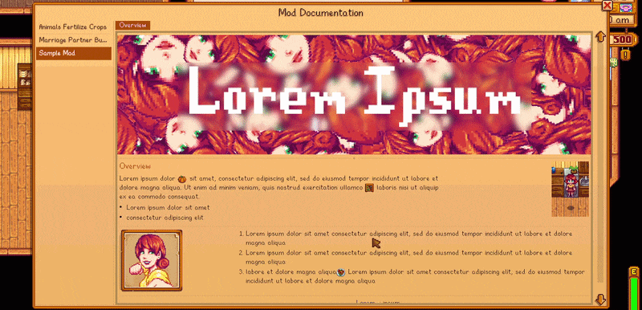

<p align="center">
  
</p>

<h1 align="center">Generic Mod Documentation Framework</h1>

<p align="center">
  
</p>

<p align="center">
  An in-game documentation viewer for Stardew Valley mods.
</p>

---

## Documentation Builder

**Mod authors:** use the online documentation builder to create your `documentation.json` without writing JSON by hand.

> **[Open the Documentation Builder](https://vapor-64.github.io/GMDFBuilder/)**

---

## What It Does

Generic Mod Documentation Framework (GMDF) adds an in-game documentation viewer to Stardew Valley. A small HUD button appears on-screen during gameplay. Clicking it opens a sidebar-style menu that shows documentation for every installed mod that has opted in. Players can flip between pages, read guides, view images and animations, and reference config options — all without leaving the game.

Mod authors do not need to write any C# to participate. Drop a `documentation.json` file into your mod folder and GMDF picks it up automatically at launch.

---

## For Players

Install GMDF and any mods that ship a `documentation.json`. The documentation button will appear on your HUD. Click it to browse help pages for all supporting mods.

**Requirements:**
- Stardew Valley 1.6.0 or later
- SMAPI 4.1 or later

---

## For Mod Authors

### Quick Start

1. Copy `example-documentation.json` from this repository into your mod folder and rename it `documentation.json`.
2. Edit the file to describe your mod. GMDF will load it automatically the next time the game launches.
3. Optionally point the `$schema` field at the hosted schema for IDE validation and autocomplete:

```json
{
  "$schema": "https://raw.githubusercontent.com/vapor64/GMDF/master/documentation.schema.json",
  "format": 1,
  "modName": "My Mod",
  "pages": [ ... ]
}
```

No dependency declaration or C# integration is required. GMDF discovers `documentation.json` files from all loaded mods automatically.

### Supported Entry Types

Pages are made up of entries. The following entry types are available:

| Type | Description |
|---|---|
| `sectionTitle` | Bold section heading |
| `paragraph` | Body text, supports `\n` line breaks |
| `caption` | Small muted text, centered by default |
| `image` | Static image from your mod assets |
| `gif` | Animated sprite sheet |
| `list` | Unordered bullet list |
| `orderedList` | Numbered list |
| `keyValue` | Config option reference row |
| `divider` | Horizontal rule (`solid`, `dotted`, or `iconCentered`) |
| `spacer` | Vertical whitespace |
| `spoiler` | Collapsible spoiler block |
| `link` | Clickable URL label |
| `row` | Horizontal layout container |

All text fields support i18n tokens using the `{{key}}` syntax, resolved from your mod's `i18n` files.

### Page Header Images

Each page can optionally include a banner image displayed above the entries:

```json
{
  "name": "Overview",
  "headerImage": { "texture": "assets/banner.png" },
  "entries": [ ... ]
}
```

### i18n Support

Any string value in `documentation.json` can use `{{token}}` syntax to pull from your mod's translation files. This lets you ship a single `documentation.json` with full multi-language support.

---

## Project Structure

```
GenericModDocumentationFramework/
├── assets/              # Icon and bundled sprites
├── i18n/                # Framework translation strings
├── Loaders/             # JSON discovery and parsing
├── Menus/               # In-game documentation UI
├── Models/              # Data models and entry types
├── Registry/            # Mod documentation registry
├── Rendering/           # Inline content rendering helpers
├── documentation.schema.json   # JSON schema for documentation.json
├── example-documentation.json  # Starter template for mod authors
└── manifest.json
```

---

## License

See the repository for license details.
